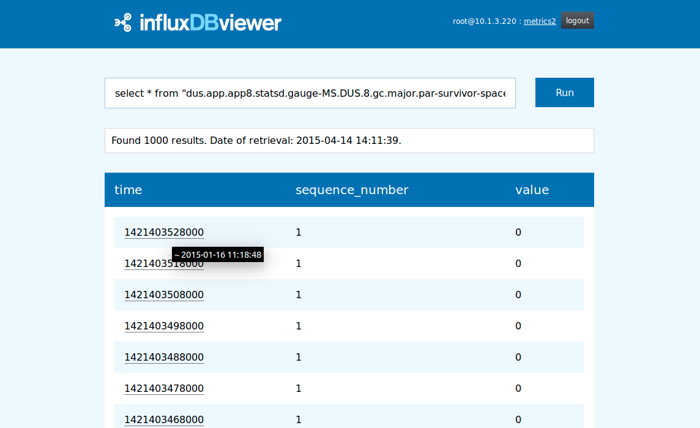

> [!CAUTION]
> This repository has been archived as of October 2025.  
> If you wish to update or extend this project, please create a fork.

# Purpose

This tool allows easier access to influxdb databases. It offers pagination, caching, command and login history and browser back button functionality. Also adds LIMIT clauses to unlimited queries, for safety. Supports both version 0.8 and 0.9+

# Usage

Requires a webserver with php.

1. Clone or download the InfluxDBviewer codebase
2. Install Dependencies via Composer:  
    `$ cd web/; curl -s http://getcomposer.org/installer | php`  
    `$ php composer.phar install`
3. apt-get install php5-curl
4. Set date.timezone option in php.ini because otherwise the twig template engine might complain.
5. Configure your webserver to include this project, and please use https because the credentials are sent to the database without being encrypted.

# Tips
* to see a human readable version of any timestamp, move the mouse over it.
* after running a list series command, click on the series name to get the latest 1000 entries for this metric.
* click on the three dots on the left of the screen to expand your query history.
* both the auto-limit and the cache can be deactivated in the config.

# Dependencies

* twig >= 1.8

# Feature suggestions
* display series name per datapoint if the select statement used a regex.

# Acknowledgements

Melanie Patrick, Kay Drechsler, Christoph Reinartz, Matthias Cieschinger, Matthias Endler, Inga Feick @ trivago GmbH
